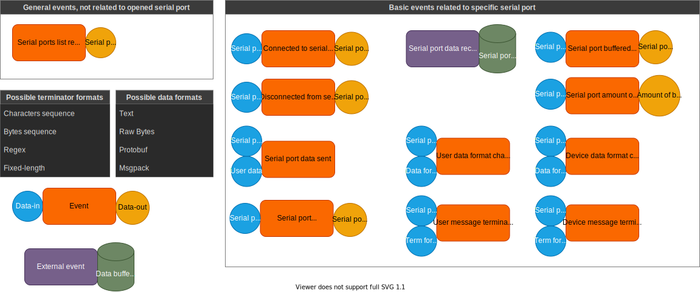

# Documentation

This directory contains the design documentation of this application - both backend and frontend (diagrams, schematics, etc.).

## Backend

Backend is made out of two main modules:

1. [Serial ports manager](../app/serialports_manager/), which will provide a reasonable interface for serial port communication and data conversion
2. [REST server](../app/rest_server/), which will provide an API for the serial ports manager

In the future, it's possible that alternatives to REST server will be added - for example gRPC or Websockets.

The [REST backend diagram](./exported/rest_backend.png) provides information about the events that the backend is supposed to handle. It's a very general document.

The [serial ports manager diagram](./exported/serialports_manager.png) provides information about functionality of serial port manager module and it's internals.

### Future ideas

* gRPC support
* Websockets support
